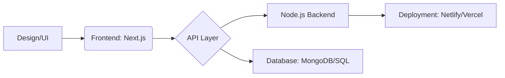

<h1>Asif Hussain</h1> 

### SOFTWARE ENGINEER | NEXT.JS | MERN STACK | JAVA | PHP

  
  
  

---

## who I am ?
I am a **Software Engineer** based in Faisalabad, Pakistan. I specialize in building high-performance, scalable web applications using the **MERN Stack** and **Next.js**. Currently, I'm learning **Data Structures & Algorithms (DSA)** in Java to master the science behind clean code and exploring System Design.

-  **Current Mission:** Mastering System Design and React 19.
-  **Project Focus:** Full-stack applications with serverless architecture.
-  **Writing:** Authoring TypeScript interview preparation notes.

---

##  My Tech Ecosystem

| Category | Tools & Technologies |
| :--- | :--- |
| **Frontend** |     |
| **Backend** |     |
| **Database** |    |
| **DevOps/Tools** |    |

---

##  Development Workflow

## Certification and Achievements 
- ### IBM Full Stack Software Developer Professional 
- ### Google Agile Essentials
- ### Atlassian Agile Project Management 
- ### Cisco IT Essentials 
